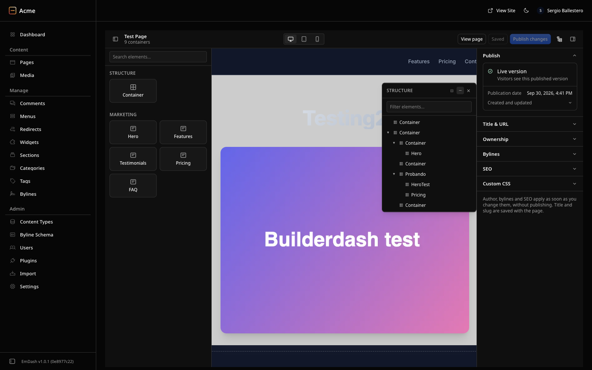
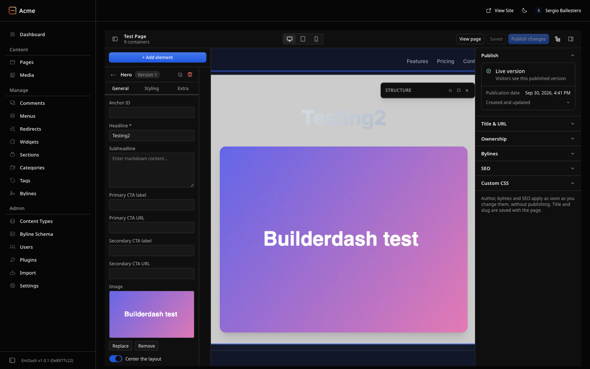

# Builderdash

Visual page builder plugin for [EmDash](https://github.com/emdash-cms/emdash), in the spirit of Elementor.

> **Alpha.** Builderdash is under active development: the data format and the API may change between versions. Try it on a test site first.

<!-- builderdash:screenshots -->
<p align="center">
	
</p>

<p align="center">
	
</p>

## Features

- **Live preview:** edit the real page, rendered by your site, in an iframe, with desktop, tablet and mobile views.
- **Drag and drop** from the element list, inside the preview and in the floating **Structure** panel.
- **Add in place,** as in Elementor: the preview ends with a **Drag widget here** area, hovering a container shows a tab with **+** (a new empty container above it), a drag handle and **×** (delete), and an empty container shows a **+**. Each **+** opens the element list; the next element you pick lands on that spot. The canvas chrome is added by the editor only — the published page never has it.
- **Context menu,** as in Elementor: right-click an element in the preview or a row in **Structure** (or press the Menu key / Shift+F10) for **Duplicate** (⌘D), **Copy** (⌘C), **Paste** (⌘V), **Copy style**, **Paste style** (⌘⇧V, same element type), **Reset style** and **Delete** (⌫). The clipboard lives in `localStorage`, so a copy pastes in another tab; content blocks travel with their element and get fresh keys. Shortcuts never fire while you type, and ⌘+right-click keeps the browser's menu.
- **Your site's blocks** (Hero, FAQ, Pricing…) next to the builder's **Container**: insert, edit inline or in the Inspector, duplicate, delete.
- **Inspector** with General, Styling (per device: spacing, size, background, border, shadow, typography) and Extra (CSS ID, classes, z-index, hide per device) tabs.
- **Details panel** like EmDash's editor: publish, discard, schedule, title and slug, author, bylines, SEO and per-page custom CSS.
- Changes stay in the browser until **Save**; **Publish changes** saves and publishes.

## About

- **Package:** `@lickybuay/builderdash`
- **Version:** 0.1.0 (alpha)
- **Works on:** any collection that has the builder fields. The installer enables `pages` and `posts` (those your seed has: the `marketing` template has no `posts`), and works on the `blank`, `starter`, `blog`, `portfolio` and `marketing` templates.
- **Type:** native EmDash plugin
- **Requires:** EmDash `>= 1.0`, Astro with `@astrojs/react`, React 18 or 19
- **License:** MIT

## Quick install

From the root of your EmDash site, with the package manager you use:

```bash
# pnpm
pnpm add github:lickybuay/builderdash
pnpm exec builderdash-setup --with-render

# npm
npm install github:lickybuay/builderdash
npx builderdash-setup --with-render

# yarn
yarn add github:lickybuay/builderdash
yarn builderdash-setup --with-render
```

Pin a version with a tag, for example `github:lickybuay/builderdash#v0.1.0`. With Yarn
Berry (2+), Git dependencies are packed by running their install, which takes longer;
pnpm or npm are the quickest way to try it.

The package ships built: installing it runs no build script, so pnpm's build-script allowlist needs no entry for it.

`builderdash-setup` (`install.sh`) registers the plugin and its `builderdash()` integration in `astro.config.*`, adds the builder fields and block type to your seed, and validates it with the EmDash CLI. On a site without a seed (the `blank` template) it creates `seed/seed.json` with a `pages` collection. It is idempotent and backs up every file it changes as `<file>.builderdash.bak`.

Options:

| Flag | What it does |
| --- | --- |
| `--collections=pages,posts` | Collections to enable the builder on. Default `pages,posts`; only those present in the seed are used. |
| `--apply-schema` | Also applies the schema to the local database (`emdash seed --no-content`). Needed on a site that is already set up: the seed only applies on first setup. |
| `--skip-install` | Configure only, without installing the package. |
| `--with-render[=path]` | Creates `src/pages/builder-render.astro`, the route the live preview uses to re-render edited content blocks with your components. `path` is your blocks component (auto-detected for the official templates). Never overwrites an existing route. |

Then restart the dev server.

## Manual configure

Install the package (`pnpm add github:lickybuay/builderdash`, `npm install github:lickybuay/builderdash` or `yarn add github:lickybuay/builderdash`; it ships built, no install script runs), then:

### 1. Register the plugin

```js
// astro.config.mjs
import { builderdash, builderdashPlugin } from "@lickybuay/builderdash";

export default defineConfig({
	integrations: [
		builderdash(),
		react(),
		emdash({
			// ...database, storage
			plugins: [builderdashPlugin()],
		}),
	],
});
```

`builderdash()` makes the builder share EmDash's admin libraries (Lingui, React Query,
kumo). Without it the builder fails with "useLingui hook was used without
I18nProvider" and the content list shows "Plugin column unavailable".

### 2. Add the builder fields to `seed/seed.json`

On each collection you want to build (for example `pages` and `posts`), add:

```json
{ "slug": "builder_layout", "label": "Builder layout", "type": "blocks",
  "validation": { "allowedTypes": ["builder_container", "builder_content_ref"], "maxItems": 100 } },
{ "slug": "builder_styles", "label": "Builder styles", "type": "json" }
```

Under `blockTypes`, add:

```json
{
  "slug": "builder_container",
  "label": "Container",
  "category": "Builder",
  "currentVersion": 1,
  "versions": [{
    "version": 1,
    "fields": [
      { "slug": "gap", "label": "Gap", "type": "select", "defaultValue": "md",
        "validation": { "options": ["none", "sm", "md", "lg"] } },
      { "slug": "direction", "label": "Direction", "type": "select", "defaultValue": "column",
        "validation": { "options": ["column", "row"] } },
      { "slug": "parent_key", "label": "Parent", "type": "string",
        "validation": { "maxLength": 32 } }
    ]
  }]
},
{
  "slug": "builder_content_ref",
  "label": "Content block",
  "category": "Builder",
  "currentVersion": 1,
  "versions": [{
    "version": 1,
    "fields": [
      { "slug": "ref_key", "label": "Content block", "type": "string",
        "validation": { "maxLength": 64 } },
      { "slug": "parent_key", "label": "Parent", "type": "string",
        "validation": { "maxLength": 32 } }
    ]
  }]
}
```

### 3. Apply the schema to an existing database

```bash
npx emdash seed seed/seed.json --no-content
```

## Open the builder

In the admin, open a collection with the builder fields and click **Edit with BuilderDash** on an entry. The button appears only on collections that declare `builder_layout`.

## Create a template

On a template collection, the admin's **Create** opens the builder's blank canvas
instead of EmDash's content editor, so the layout is built before the entry
exists.

**How it is intercepted.** EmDash exposes no extension point for that button: it
is a router link to `/content/<collection>/new`, and the editor panels are not
rendered on the "new" page. The admin is a client-side SPA, so a server redirect
cannot catch an in-app navigation either. `src/editor/new-entry-redirect.ts`
therefore works in two layers:

- A click on the create link is cancelled in the capture phase, before the
  router handles it, and the browser goes straight to the builder. EmDash's
  editor never renders.
- Any other path to the "new" page (a programmatic navigation, back/forward, a
  typed URL) is caught by watching the SPA's history. Those routes still show
  EmDash's editor for one frame before the builder — a supported hook would
  remove it.

The builder is opened with a full page load, like **Edit with BuilderDash**, so
the admin's loading shell shows briefly. The create link's `?locale=` is not
carried over to the builder.

Only the template collection is redirected; every other collection keeps
EmDash's own create flow.

### Templates in the builder

- In the Templates list, the title and the pencil open the builder. EmDash's own
  editor (category, display target, revisions…) stays reachable from the
  Inspector's edit link, or with `?native=1` on the entry URL.
- A new template shows a single **Create** button: it creates the draft and
  reopens the builder; **Save** and **Publish** appear once it exists.
- The **Template** element (Reusable) embeds a saved template by reference, like
  Elementor Pro's Template widget: drag it in, pick the template in the
  Inspector, and it shows right away. Editing that template updates every page
  that embeds it. The top bar's inserter copies a template instead.
- A template can never embed itself, directly or through another (A → B → A):
  the picker leaves those out, and the render stops a loop, nests at most 5
  levels and expands at most 50 templates per page.
- `builderdash-setup --with-render` also creates `src/pages/template-preview.astro`
  when your seed has a `templates` collection: the route the builder previews
  templates through. It has no site chrome; add your layout, header and footer
  to see templates as they will look.

## Render on your site

The builder edits the layout; your site decides where it renders. Three small
changes in the site, shown for the marketing template (`Base.astro`, a page
route, and the component that renders the entry's `content` blocks).

### 1. Let the layout skip its header/footer and take body classes

```astro
---
// src/layouts/Base.astro
interface Props {
	/* …existing props… */
	chrome?: boolean;              // false: the builder layout places header/footer
	bodyClass?: string | string[]; // CSS hooks, e.g. page-<id>
}
const { chrome = true, bodyClass } = Astro.props;
---
<body class:list={bodyClass}>
	{chrome ? (<><SiteHeader /><main><slot /></main><SiteFooter /></>) : <slot />}
</body>
```

Move the header and footer markup into `SiteHeader.astro` / `SiteFooter.astro`
so both the layout and the builder can render them.

### 2. Render the layout in the page route

```astro
---
import BuilderLayout from "@lickybuay/builderdash/BuilderLayout.astro";
import { bodyClasses } from "@lickybuay/builderdash/classes";
import { builderEditRequested, builderEditMode } from "@lickybuay/builderdash/edit-mode";

const layout = page.data.builder_layout;
const hasLayout = Array.isArray(layout) && layout.length > 0;
const entry = { collection: "pages", id: page.data.id, slug: page.id };
// Edit mode needs a signed-in user, and a request that asks for it is never
// a cached variant of the public page:
if (Astro.cache?.enabled && !builderEditRequested(Astro)) Astro.cache.set(cacheHint);
const edit = builderEditMode(Astro);
---
{hasLayout ? (
	<Base chrome={false} bodyClass={bodyClasses(entry)} /* …seo props… */>
		<BuilderLayout
			layout={layout}
			styles={page.data.builder_styles}
			content={page.data.content}
			header={SiteHeader}
			footer={SiteFooter}
			blocks={MarketingBlocks}
			blockTypes={["marketing_hero", "marketing_faq" /* …types your blocks component renders */]}
			edit={edit}
			entry={entry}
		/>
	</Base>
) : (
	/* your existing render */
)}
```

`builderEditMode` turns the live-preview markup (`?_builder`) on only for a
signed-in user: an anonymous visitor who appends `?_builder` gets the plain
public page. The builder's own iframe carries the editor's session cookie, so
it is unaffected. Pass `builderEditRequested(Astro)` to the cache guard the
same way your route guards `cacheHint`, so an edit-mode render never becomes
a cached variant of the public page.

`blockTypes` lists the block types your site has a component for. A placed
block of any other type shows **Missing component: …** in the builder's preview
and renders nothing on the site. Omit it to render every block.

The builder's palette offers the block types your `content` field allows; a
type you disable there disappears from the palette, and blocks already placed
show as missing in the builder.

### 3. Live preview of edited blocks

The Inspector re-renders an edited content block through a site route, so it is
drawn by your own component. `builderdash-setup --with-render` creates
`src/pages/builder-render.astro` for you (it needs your blocks component); or
copy [`templates/builder-render.astro`](templates/builder-render.astro) and set
the import and the allowed block types.

### CSS hooks

- `<body class="page-<id>">` (`post-<id>` for posts).
- `<main class="builderdash" data-bd-id="…" data-bd-slug="…" data-bd-collection="…">`.
- Each element: CSS ID and classes from the Inspector's **Extra** tab.

## Development

```bash
pnpm install
pnpm typecheck
pnpm test
pnpm build
```

To try your changes in a site, see [CONTRIBUTING.md](CONTRIBUTING.md).

## Contributing

Issues and pull requests are welcome: read [CONTRIBUTING.md](CONTRIBUTING.md) first.
Report security problems privately, as described in [SECURITY.md](SECURITY.md).

## License

[MIT](LICENSE) © Sergio Ballestero
